````md id="2vwk36"
# 02-user-flow.md
# User Flow Document
# YogaFX LMS

## 1. Introduction

Dokumen ini menjelaskan alur interaksi user dengan sistem YogaFX LMS dari awal sampai akhir.

Fokus dokumen ini adalah:
- bagaimana user menggunakan sistem
- apa yang memicu sebuah flow
- kondisi yang harus terpenuhi sebelum flow berjalan
- alur utama
- alur alternatif
- alur gagal
- hasil akhir yang diharapkan

Dokumen ini menggunakan seluruh keputusan terbaru yang sudah disepakati sebagai sumber kebenaran utama, termasuk:
- role utama: Admin dan Student
- membership tier: Online, MasterClass, Starter Kit
- web application berbasis Laravel + React + Inertia
- lesson locking
- workbook requirement
- video watch progress minimal 95%
- assessment berbasis pages
- assignment dynamic by assignment type
- certificate generated by admin
- email template dengan 6 notification type

---

## 2. Registration & Login Flow

### Purpose
Memungkinkan user membuat akun, masuk ke sistem, dan diarahkan ke area yang sesuai berdasarkan role.

### Trigger
- User membuka halaman signup
- User membuka halaman login
- User mengirim form registrasi atau login

### Preconditions
- Sistem tersedia dan dapat diakses
- Halaman auth aktif
- Untuk login, user sudah memiliki akun
- Untuk signup, mekanisme signup tersedia pada sistem

### Main Flow
1. User membuka halaman signup atau login.
2. Jika user belum memiliki akun, user mengisi data registrasi.
3. Sistem membuat akun baru untuk user.
4. Sistem menentukan access tier sesuai kebijakan bisnis yang berlaku.
5. Sistem memicu email `signup` jika template aktif.
6. User login menggunakan email dan password.
7. Sistem memvalidasi kredensial.
8. Sistem membuat sesi login aktif.
9. Sistem membedakan role user:
   - Admin diarahkan ke admin dashboard
   - Student diarahkan ke student dashboard
10. Sistem mulai menghitung durasi akses user.

### Alternative Flow
- Setelah signup berhasil, sistem dapat langsung mengarahkan user ke login.
- Jika student profile belum lengkap, sistem mengarahkan ke profile completion setelah login.
- Jika signup dilakukan oleh admin, user bisa langsung menerima akun tanpa self-registration flow penuh.

### Failure Flow
- Email sudah terdaftar.
- Password salah.
- Data registrasi tidak valid.
- Sistem gagal membuat session login.
- Email signup gagal terkirim.

### Success Outcome
- User berhasil masuk ke sistem.
- Session login aktif.
- User berada di dashboard yang sesuai role.
- Signup notification terkirim jika diaktifkan.

```mermaid
flowchart TD
    A[User opens auth page] --> B{Signup or Login?}
    B -->|Signup| C[Fill registration form]
    C --> D[Validate registration data]
    D --> E{Valid?}
    E -->|No| F[Show validation errors]
    E -->|Yes| G[Create user account]
    G --> H[Assign access tier]
    H --> I[Trigger signup email if enabled]
    I --> J[Redirect to login or auto-auth]

    B -->|Login| K[Fill login form]
    J --> K
    K --> L[Validate credentials]
    L --> M{Valid?}
    M -->|No| N[Show login error]
    M -->|Yes| O[Create active session]
    O --> P{Role?}
    P -->|Admin| Q[Redirect to Admin Dashboard]
    P -->|Student| R[Redirect to Student Dashboard]
````

---

## 3. Student Onboarding Flow

### Purpose

Memastikan student melengkapi data profile dan memahami langkah awal sebelum mulai belajar.

### Trigger

* Student berhasil login pertama kali
* Student membuka profile
* Sistem mendeteksi profile belum lengkap

### Preconditions

* Student sudah berhasil login
* Student memiliki role Student
* Akses tier sudah ditentukan

### Main Flow

1. Student login ke sistem.
2. Sistem memeriksa apakah profile student sudah lengkap.
3. Jika belum lengkap, student diarahkan ke halaman profile.
4. Student mengisi data profile:

   * personal information
   * yoga experience
   * contact information
   * preferred certificate picture bila diwajibkan
5. Sistem memvalidasi data input.
6. Student menyimpan profile.
7. Sistem mengarahkan student ke dashboard.
8. Dashboard menampilkan konten yang sesuai tier dan progress awal.

### Alternative Flow

* Jika profile sudah lengkap, student langsung masuk dashboard.
* Admin dapat melengkapi atau memperbarui profile student dari area admin.

### Failure Flow

* Student mengosongkan field wajib.
* Format email/WhatsApp tidak valid.
* Upload gambar gagal.
* Student keluar sebelum profile tersimpan.

### Success Outcome

* Profile student lengkap dan tersimpan.
* Student siap mengikuti learning journey.

```mermaid
flowchart TD
    A[Student logs in] --> B[System checks profile completeness]
    B --> C{Profile complete?}
    C -->|Yes| D[Redirect to Student Dashboard]
    C -->|No| E[Redirect to Profile Completion]
    E --> F[Student fills profile form]
    F --> G[Validate profile data]
    G --> H{Valid?}
    H -->|No| I[Show validation errors]
    H -->|Yes| J[Save profile]
    J --> D
```

---

## 4. Student Dashboard Flow

### Purpose

Menjadi pusat akses utama student terhadap progress, konten aktif, assignment, dan certificate.

### Trigger

* Student login
* Student membuka dashboard
* Student kembali dari lesson/assessment/assignment

### Preconditions

* Student sudah login
* Role adalah Student

### Main Flow

1. Student membuka dashboard.
2. Sistem menampilkan ringkasan:

   * module/lesson terakhir
   * progress belajar
   * assignment status
   * certificate status
   * shortcut ke modules, ebooks, dan courses
3. Student memilih aksi berikutnya:

   * continue learning
   * buka modules
   * buka assignment
   * buka certificate
   * buka ebooks/courses

### Alternative Flow

* Jika belum ada progress sama sekali, dashboard menampilkan keadaan awal.
* Jika semua module selesai, dashboard menampilkan status completion.
* Jika ada assignment pending/rejected, dashboard menonjolkan area assignment.

### Failure Flow

* Data progress gagal dimuat.
* Session user tidak valid.
* Student tidak memiliki akses ke konten apa pun karena tier restriction.

### Success Outcome

* Student mendapatkan gambaran posisi belajar saat ini.
* Student dapat melanjutkan flow berikutnya dengan cepat.

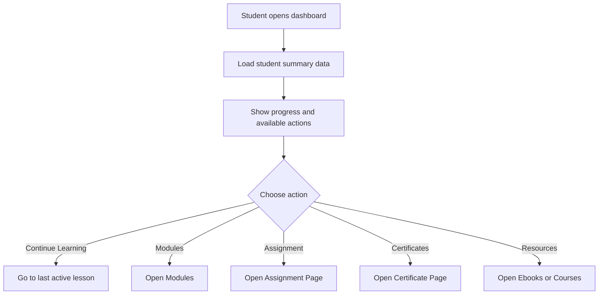

---

## 5. Module & Lesson Learning Flow

### Purpose

Mengatur perjalanan belajar student secara terurut, terkontrol, dan sesuai tier.

### Trigger

* Student membuka module dari dashboard
* Student memilih lesson dalam module

### Preconditions

* Student login
* Student memiliki tier yang sesuai
* Lesson yang dipilih harus unlocked

### Main Flow

1. Student membuka daftar modules.
2. Sistem hanya menampilkan modules yang sesuai tier.
3. Student membuka salah satu module.
4. Sistem menampilkan list lesson dalam module tersebut.
5. Student memilih lesson.
6. Sistem memeriksa:

   * apakah lesson sesuai tier
   * apakah lesson sebelumnya sudah complete
7. Jika lesson terbuka, halaman lesson ditampilkan.
8. Jika workbook tersedia, student harus download workbook dulu.
9. Setelah syarat workbook terpenuhi, student dapat mengakses video, audio, dan content.
10. Student menonton video lesson.
11. Sistem menyimpan watch progress.
12. Jika lesson memiliki assessment:

* assessment tetap locked sampai watch progress minimal 95%

13. Jika lesson tidak memiliki assessment:

* lesson dapat dianggap complete setelah video selesai

14. Setelah syarat complete terpenuhi, lesson berikutnya di-unlock.

### Alternative Flow

* Lesson dapat memiliki workbook, video, audio, dan content sekaligus.
* Lesson dapat tidak memiliki assessment.
* Student dapat kembali ke lesson sebelumnya yang sudah terbuka.

### Failure Flow

* Student mencoba membuka lesson yang locked.
* Workbook belum di-download.
* Video gagal dimuat.
* Watch progress gagal tersimpan.

### Success Outcome

* Student berhasil menyelesaikan lesson sesuai rule.
* Progress lesson tersimpan.
* Lesson berikutnya terbuka jika syarat terpenuhi.

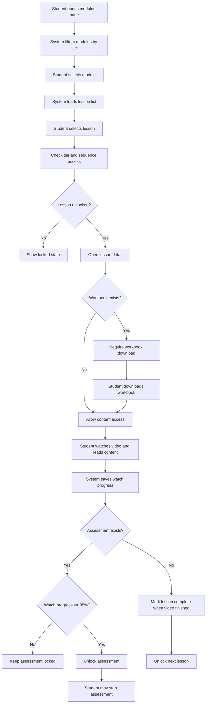

---

## 6. Assessment Flow

### Purpose

Memungkinkan student mengerjakan evaluasi pembelajaran dengan timer, autosave, page structure, dan result tracking.

### Trigger

* Student menekan tombol Start Assessment pada lesson yang sudah memenuhi syarat unlock

### Preconditions

* Student login
* Assessment terhubung ke lesson
* Watch progress minimal 95% jika lesson memiliki video
* Lesson unlocked
* Student memiliki akses tier yang sesuai

### Main Flow

1. Student membuka assessment intro.
2. Sistem menampilkan:

   * title
   * description
   * duration
3. Student klik Start Assessment.
4. Sistem membuat assessment attempt baru.
5. Sistem menetapkan:

   * started_at
   * expires_at
   * status in_progress
6. Sistem memuat page pertama.
7. Student menjawab pertanyaan.
8. Sistem autosave jawaban saat student mengisi atau berpindah langkah.
9. Student berpindah antar page.
10. Sistem menghitung progress pengerjaan berdasarkan jumlah question yang sudah dijawab.
11. Student menekan Submit, atau sistem auto-submit saat waktu habis.
12. Sistem menghitung score.
13. Sistem memperbarui ringkasan progress assessment.
14. Sistem menampilkan result screen.

### Alternative Flow

* Question dapat berupa single_choice, multiple_choice, text, atau true_false.
* Student dapat berpindah page sebelum semua pertanyaan di page aktif selesai.
* Assessment dapat selesai otomatis saat timer habis meskipun belum semua soal dijawab.

### Failure Flow

* Assessment gagal dimulai.
* Jawaban gagal tersimpan.
* Waktu habis saat autosave belum sinkron.
* Student mencoba membuka assessment padahal belum unlocked.

### Success Outcome

* Attempt tersimpan.
* Jawaban tersimpan.
* Result tersedia.
* Progress assessment ter-update.

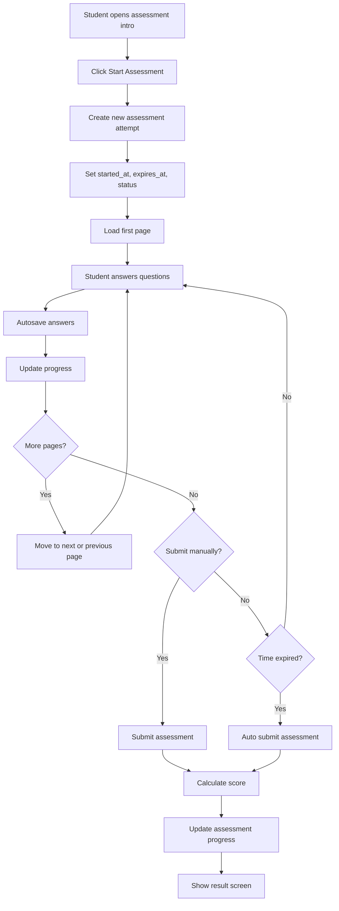

---

## 7. Assignment Submission Flow

### Purpose

Memungkinkan student mengirim assignment video sesuai assignment type dan tier eligibility.

### Trigger

* Student membuka halaman assignment
* Student memilih assignment type
* Student submit video assignment

### Preconditions

* Student login
* Student memiliki hak submit assignment berdasarkan tier
* Assignment type valid
* Student berada di tahap pembelajaran yang mengizinkan assignment

### Main Flow

1. Student membuka halaman assignment.
2. Sistem menampilkan daftar assignment type dan status saat ini.
3. Student memilih assignment type yang ingin dikirim.
4. Student upload video assignment.
5. Sistem memvalidasi submission.
6. Sistem menyimpan assignment dengan status awal `pending_review`.
7. Sistem memicu email `assignment_review` jika aktif.
8. Student melihat status updated di halaman assignment.

### Alternative Flow

* Student dapat submit assignment type yang berbeda pada waktu berbeda.
* Jika assignment sebelumnya rejected, student dapat re-upload sesuai kebijakan.

### Failure Flow

* Tier student tidak berhak submit assignment.
* Upload video gagal.
* Assignment type tidak valid.
* File tidak lolos validasi.

### Success Outcome

* Assignment tersimpan.
* Status review awal tercatat.
* Admin dapat mereview submission.
* Student menerima status pending_review.

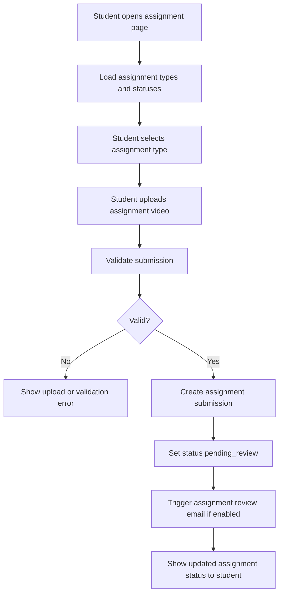

---

## 8. Certificate Flow

### Purpose

Mengatur bagaimana certificate dibuat oleh admin dan diakses oleh student.

### Trigger

* Admin generate certificate
* Student membuka halaman certificate

### Preconditions

* Student login untuk akses student side
* Admin login untuk generate/recreate
* Student memenuhi syarat certificate berdasarkan tier dan flow bisnis
* Certificate sudah dibuat untuk dapat diakses student

### Main Flow

1. Admin membuka area certificate atau detail student.
2. Admin memilih certificate type:

   * Bikram Yoga Certificate
   * Yoga Alliance Certification
3. Admin klik Generate Certificate.
4. Sistem membuat file certificate.
5. Sistem menyimpan record certificate.
6. Sistem menyimpan versi certificate.
7. Sistem memicu email `certificate_created` jika aktif.
8. Student membuka halaman certificate.
9. Sistem menampilkan daftar certificate milik student.
10. Student mengunduh certificate yang tersedia.

### Alternative Flow

* Admin dapat recreate certificate.
* Student dapat memiliki lebih dari satu certificate type jika rule bisnis mengizinkan.

### Failure Flow

* Admin mencoba generate padahal student belum eligible.
* File certificate gagal dibuat.
* Certificate tidak ditemukan saat student ingin download.
* Email certificate gagal dikirim.

### Success Outcome

* Certificate berhasil dibuat.
* Certificate tersedia untuk student.
* Email certificate terkirim jika aktif.

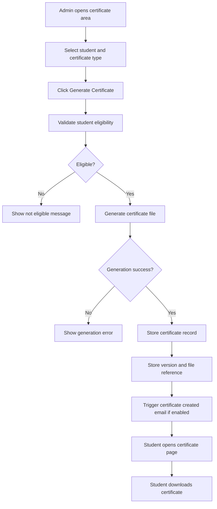

---

## 9. Ebook Access Flow

### Purpose

Memungkinkan student mengakses ebook yang sesuai dengan membership tier.

### Trigger

* Student membuka halaman ebooks
* Student memilih salah satu ebook

### Preconditions

* Student login
* Ebook tersedia
* Student memiliki tier yang mengizinkan akses ebook tersebut

### Main Flow

1. Student membuka halaman ebooks.
2. Sistem memfilter ebook berdasarkan tier student.
3. Student melihat daftar ebook yang tersedia.
4. Student memilih ebook.
5. Sistem menampilkan atau mengunduhkan file ebook sesuai implementasi.
6. Student menggunakan ebook sebagai resource pembelajaran.

### Alternative Flow

* Ebook hanya didownload, bukan dibaca inline.
* Ebook dapat dipakai sebagai resource tambahan di luar lesson tertentu.

### Failure Flow

* Student tidak memiliki akses tier yang sesuai.
* File ebook hilang atau rusak.
* Sistem gagal memuat resource.

### Success Outcome

* Student dapat mengakses ebook yang diizinkan.
* Resource berhasil digunakan dalam learning journey.

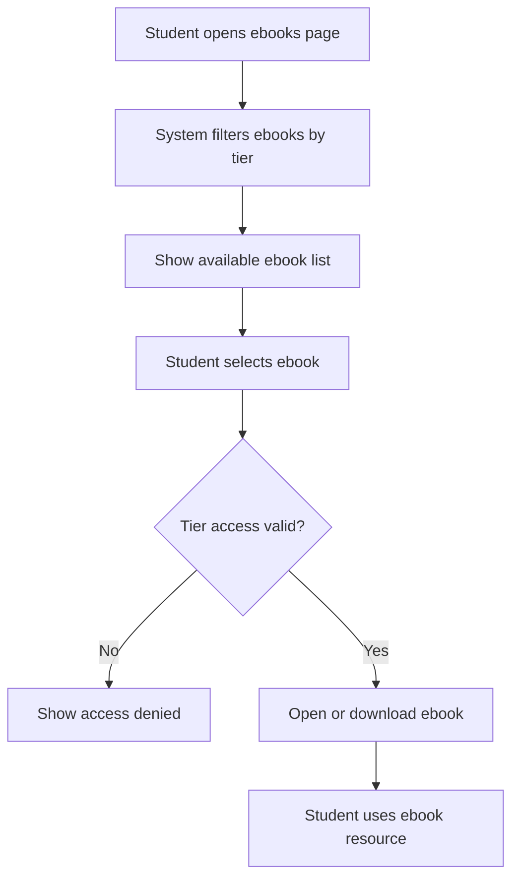

---

## 10. Admin Dashboard Flow

### Purpose

Menjadi pusat operasional untuk seluruh aktivitas admin.

### Trigger

* Admin login
* Admin membuka dashboard

### Preconditions

* User login sebagai Admin

### Main Flow

1. Admin login.
2. Sistem mengarahkan admin ke dashboard.
3. Dashboard memuat ringkasan:

   * total students
   * active students
   * pending assignment
   * completion overview
   * recent operational info
4. Admin memilih modul kerja berikutnya:

   * content management
   * student management
   * assignment review
   * certificate management
   * email settings

### Alternative Flow

* Dashboard dapat menampilkan shortcut cepat ke area paling sering dipakai.
* Dashboard dapat menampilkan alert operasional.

### Failure Flow

* Statistik gagal dimuat.
* Session admin tidak valid.

### Success Outcome

* Admin mendapatkan gambaran umum sistem.
* Admin dapat cepat berpindah ke area kerja berikutnya.

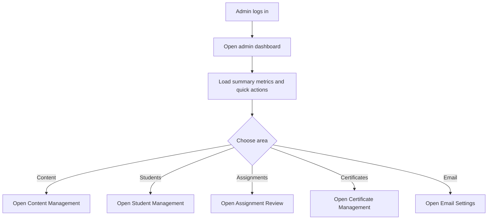

---

## 11. Content Management Flow

### Purpose

Memungkinkan admin mengelola access tiers, modules, lessons, ebooks, dan courses.

### Trigger

* Admin membuka salah satu area manajemen konten
* Admin klik create, edit, atau delete

### Preconditions

* Admin login
* Role adalah Admin

### Main Flow

1. Admin membuka area konten yang ingin dikelola.
2. Admin melihat daftar data.
3. Admin memilih aksi:

   * create
   * edit
   * delete
4. Jika create/edit:

   * admin mengisi form
   * sistem memvalidasi data
   * sistem menyimpan perubahan
5. Jika delete:

   * admin melakukan konfirmasi
   * sistem menghapus data jika diperbolehkan
6. Sistem memperbarui daftar data.

### Alternative Flow

* Pada lesson, admin dapat menghubungkan assessment secara opsional.
* Pada lesson, admin dapat mengunggah workbook/audio dan menyimpan video reference.
* Pada course/ebook, admin menetapkan access tier.

### Failure Flow

* Validasi gagal.
* Slug duplikat.
* Delete tidak diperbolehkan karena dependency.
* Upload media gagal.

### Success Outcome

* Konten tersimpan dengan benar.
* Konten siap digunakan oleh student sesuai rule akses.

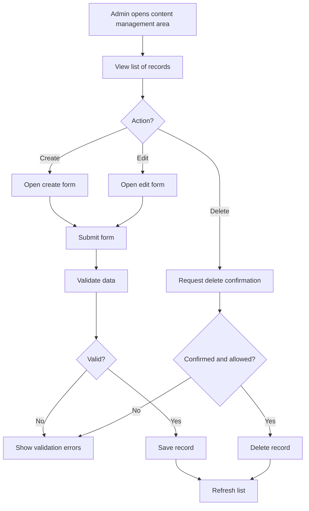

---

## 12. Assessment Management Flow

### Purpose

Memungkinkan admin membangun assessment secara page-based dan mengelola soal serta opsi jawaban.

### Trigger

* Admin membuka area assessment
* Admin membuat atau mengedit assessment

### Preconditions

* Admin login
* Role adalah Admin

### Main Flow

1. Admin membuka halaman assessment list.
2. Admin membuat assessment baru atau membuka assessment yang sudah ada.
3. Admin mengisi title, description, dan duration.
4. Admin menambahkan page pertama.
5. Pada page aktif, admin menambahkan question.
6. Admin memilih question type.
7. Jika question type membutuhkan option, admin menambahkan option.
8. Admin dapat menambah page baru.
9. Admin dapat mengurutkan page dan question.
10. Admin menyimpan struktur assessment.
11. Admin dapat melakukan preview assessment.

### Alternative Flow

* Question type text tidak membutuhkan option.
* Admin dapat menambah banyak page dan banyak question per page.
* Admin dapat mengubah urutan.

### Failure Flow

* Question dibuat tanpa type valid.
* Option tidak sesuai type.
* Assessment gagal disimpan.
* Relasi antar page dan question tidak valid.

### Success Outcome

* Assessment tersusun lengkap dan siap digunakan oleh student.

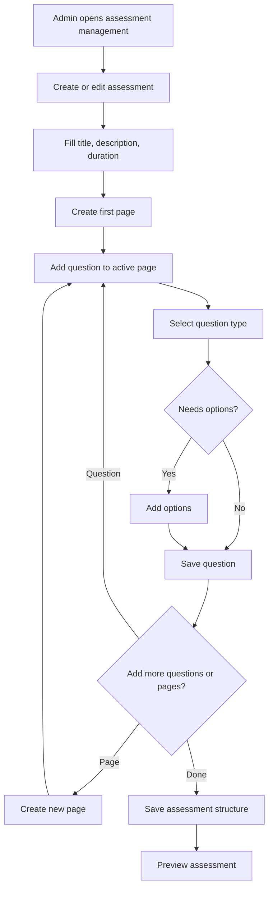

---

## 13. Assignment Review Flow

### Purpose

Memungkinkan admin memeriksa assignment submission, lalu menyetujui atau menolak dengan feedback.

### Trigger

* Admin membuka halaman assignment submissions
* Admin memilih salah satu submission

### Preconditions

* Admin login
* Ada assignment submission yang tersedia

### Main Flow

1. Admin membuka list assignment submissions.
2. Admin memilih salah satu submission.
3. Sistem menampilkan detail:

   * student
   * assignment type
   * video
   * current status
4. Admin meninjau video.
5. Admin memilih:

   * Approve
   * Reject
6. Jika Reject, admin wajib mengisi feedback.
7. Sistem menyimpan keputusan.
8. Sistem memicu email:

   * `assignment_approved` jika approved
   * `assignment_rejected` jika rejected
9. Student melihat status baru pada halaman assignment.

### Alternative Flow

* Admin dapat membuka kembali submission yang sudah pernah direview untuk melihat histori status saat implementasi mendukungnya.
* Student dapat submit ulang jika rejected dan kebijakan mengizinkan.

### Failure Flow

* Video tidak dapat dibuka.
* Admin reject tanpa feedback.
* Sistem gagal menyimpan keputusan.
* Trigger email gagal.

### Success Outcome

* Assignment memiliki keputusan review yang jelas.
* Student mendapat status dan feedback yang sesuai.

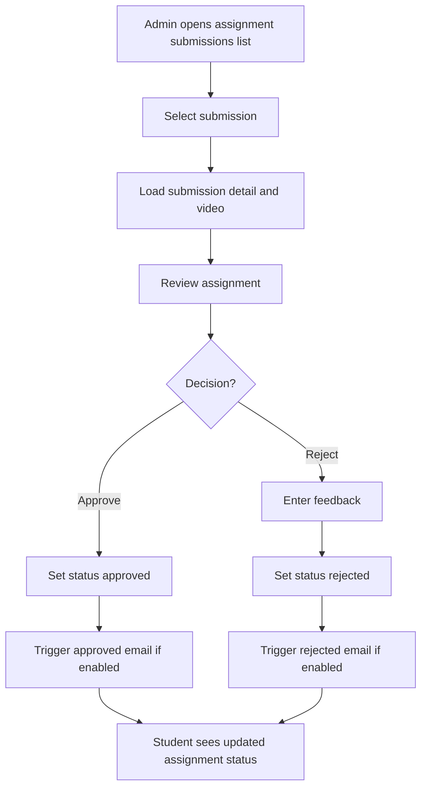

---

## 14. Certificate Management Flow

### Purpose

Memungkinkan admin membuat, recreate, dan mengelola certificate student.

### Trigger

* Admin membuka halaman certificate
* Admin memilih generate atau recreate

### Preconditions

* Admin login
* Student dan certificate context tersedia

### Main Flow

1. Admin membuka certificate management.
2. Admin melihat daftar certificate atau detail student.
3. Admin memilih aksi:

   * Generate
   * Recreate
   * Download
   * Delete
4. Jika generate/recreate:

   * sistem memvalidasi konteks
   * sistem membentuk file certificate
   * sistem menyimpan record dan versi
5. Jika download:

   * admin mengunduh file certificate
6. Jika delete:

   * admin mengonfirmasi penghapusan
7. Jika generate berhasil:

   * sistem memicu email `certificate_created` bila aktif

### Alternative Flow

* Student dapat memiliki lebih dari satu certificate type jika bisnis mengizinkan.
* Recreate menghasilkan versi baru.

### Failure Flow

* Student tidak eligible.
* File gagal dibuat.
* File tidak tersedia untuk download.
* Delete gagal karena kendala sistem.

### Success Outcome

* Certificate terkelola dengan baik.
* Student memiliki certificate yang valid dan dapat diakses.

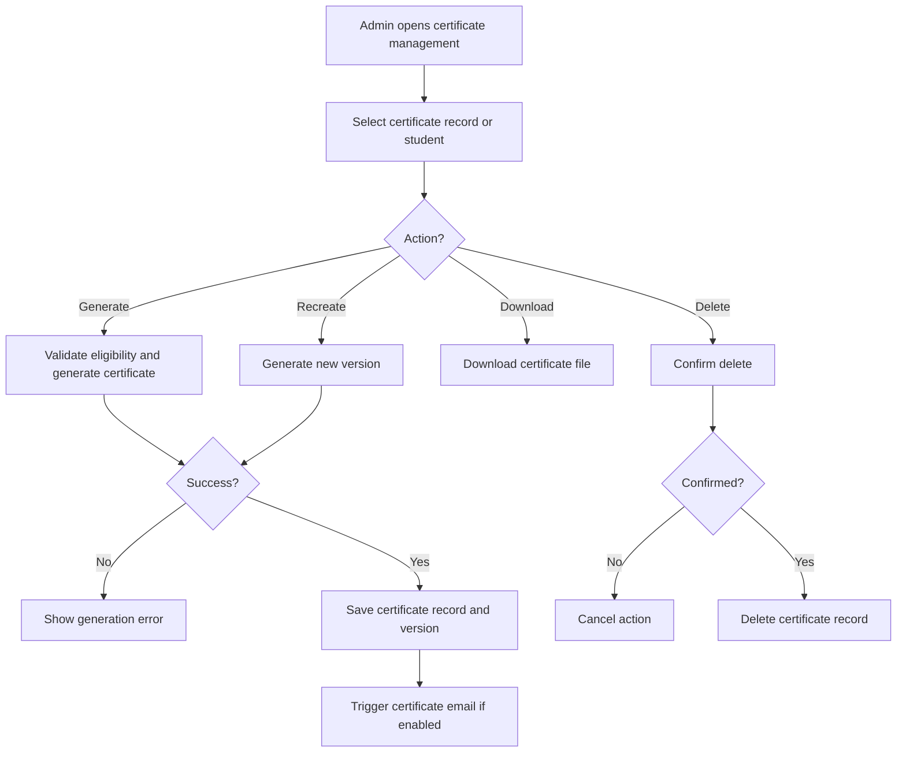

---

## 15. Email Notification Flow

### Purpose

Mengelola template email otomatis, placeholder, dan send test manual untuk 6 notification type yang disepakati.

### Trigger

* Admin membuka salah satu sub menu email
* Admin klik Save Changes
* Admin klik Send Test
* Trigger bisnis asli terjadi di sistem

### Preconditions

* Admin login
* Notification type valid
* Template email tersedia atau siap diisi

### Main Flow

1. Admin membuka menu Email Notification.
2. Admin memilih satu sub menu:

   * Module Completion
   * Assignments Review
   * Assignments Approved
   * Assignments Rejected
   * Certificate Created
   * Signup
3. Sistem menampilkan form template:

   * enable notification
   * admin recipients
   * admin subject/body
   * user subject/body
   * available merge tags
4. Jika template belum pernah disimpan, field bisa kosong.
5. Admin mengisi atau mengubah template.
6. Admin klik Save Changes.
7. Sistem menyimpan template.
8. Saat trigger bisnis asli terjadi:

   * sistem mencari template berdasarkan notification type
   * sistem memeriksa apakah template aktif
   * sistem mengganti placeholder dengan data nyata
   * sistem mengirim email ke user dan/atau admin
   * sistem mencatat email log
9. Jika admin klik Send Test:

   * admin mengisi email tujuan
   * sistem merender template dengan sample data
   * sistem mengirim email test
   * sistem mencatat log pengiriman

### Alternative Flow

* Template bisa tetap tersimpan walaupun notification tidak aktif.
* Test email bisa dipakai untuk memverifikasi template tanpa menunggu trigger asli.

### Failure Flow

* Template tidak valid.
* Placeholder tidak dapat dirender.
* Recipient tidak valid.
* Email gagal dikirim.
* SMTP / transport mail gagal.

### Success Outcome

* Template tersimpan dan siap digunakan.
* Trigger email berjalan otomatis saat event terjadi.
* Test email berhasil terkirim.
* Semua pengiriman tercatat di log.

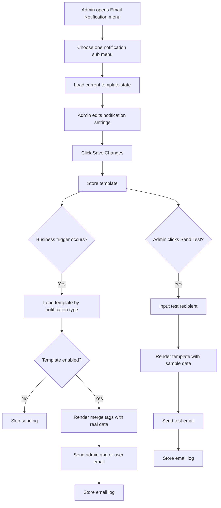

```
```
