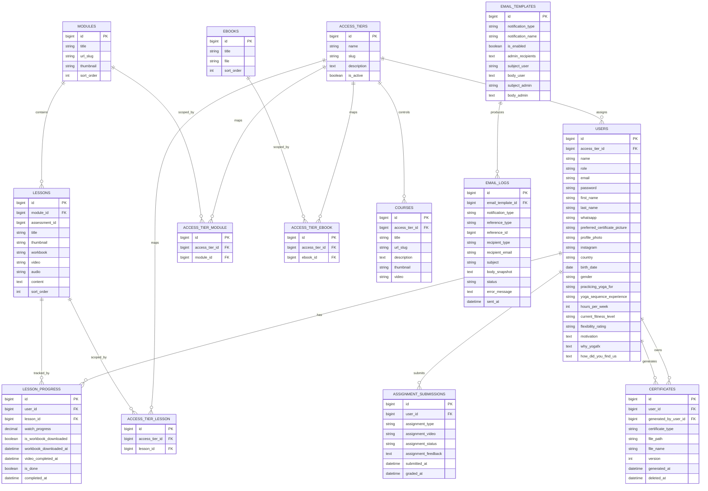

# 03-erd.md
# Entity Relationship Design
# YogaFX LMS

## 1. Purpose

Dokumen ini mendeskripsikan **model data yang benar-benar aktif** di aplikasi saat ini berdasarkan migration dan model Eloquent yang sudah ada.

Dokumen ini sengaja tidak lagi mencampur entity future yang belum dibuat.

---

## 2. Active Domains

Domain data yang sudah aktif:
- users and roles
- access tiers
- learning content
- student progress admin foundation
- certificates
- email templates and logs

Domain yang belum punya schema final dan tidak dianggap aktif di dokumen ini:
- assessments
- assessment pages
- questions
- question options
- assessment attempts
- assessment answers
- assessment progress
- dedicated user session tracking domain
- user activity logs

---

## 3. Active Entities

### 3.1 User
Purpose:
- identitas utama Admin dan Student

Key fields:
- `id`
- `name`
- `role`
- `access_tier_id`
- `email`
- `password`
- `first_name`
- `last_name`
- `whatsapp`
- `preferred_certificate_picture`
- `profile_photo`
- `instagram`
- `country`
- `birth_date`
- `gender`
- `practicing_yoga_for`
- `yoga_sequence_experience`
- `hours_per_week`
- `current_fitness_level`
- `flexibility_rating`
- `motivation`
- `why_yogafx`
- `how_did_you_find_us`

Relationships:
- belongs to one `AccessTier`
- has many `LessonProgress`
- has many `AssignmentSubmission`
- has many `Certificate`

### 3.2 AccessTier
Purpose:
- membership tier untuk student dan content access

Key fields:
- `id`
- `name`
- `slug`
- `description`
- `is_active`

Relationships:
- has many `User`
- belongs to many `Module`
- belongs to many `Lesson`
- belongs to many `Ebook`
- has many `Course`

### 3.3 Module
Purpose:
- parent pembelajaran untuk lesson

Key fields:
- `id`
- `title`
- `url_slug`
- `thumbnail`
- `sort_order`

Relationships:
- has many `Lesson`
- belongs to many `AccessTier` via `access_tier_module`

### 3.4 Lesson
Purpose:
- unit konten dalam module

Key fields:
- `id`
- `module_id`
- `assessment_id` nullable
- `title`
- `thumbnail`
- `workbook`
- `video`
- `audio`
- `content`
- `sort_order`

Relationships:
- belongs to `Module`
- belongs to many `AccessTier` via `access_tier_lesson`
- has many `LessonProgress`

### 3.5 Ebook
Purpose:
- resource file mandiri di luar lesson

Key fields:
- `id`
- `title`
- `file`
- `sort_order`

Relationships:
- belongs to many `AccessTier` via `access_tier_ebook`

### 3.6 Course
Purpose:
- konten independen berbasis video/reference

Key fields:
- `id`
- `title`
- `url_slug`
- `access_tier_id`
- `description`
- `thumbnail`
- `video`

Relationships:
- belongs to `AccessTier`

### 3.7 LessonProgress
Purpose:
- progress lesson student yang dipakai admin untuk area completed lesson

Key fields:
- `id`
- `user_id`
- `lesson_id`
- `watch_progress`
- `is_workbook_downloaded`
- `workbook_downloaded_at`
- `video_completed_at`
- `is_done`
- `completed_at`

Relationships:
- belongs to `User`
- belongs to `Lesson`

### 3.8 AssignmentSubmission
Purpose:
- menyimpan record assignment/graduation video student

Key fields:
- `id`
- `user_id`
- `assignment_type`
- `assignment_video`
- `assignment_status`
- `assignment_feedback`
- `submitted_at`
- `graded_at`

Relationships:
- belongs to `User`

### 3.9 Certificate
Purpose:
- menyimpan certificate yang dihasilkan admin untuk student

Key fields:
- `id`
- `user_id`
- `certificate_type`
- `file_path`
- `file_name`
- `version`
- `generated_by_user_id`
- `generated_at`
- `deleted_at`

Relationships:
- belongs to `User` as owner
- belongs to `User` as generator

### 3.10 EmailTemplate
Purpose:
- konfigurasi template email per notification type

Key fields:
- `id`
- `notification_type`
- `notification_name`
- `is_enabled`
- `admin_recipients`
- `subject_user`
- `body_user`
- `subject_admin`
- `body_admin`

Relationships:
- has many `EmailLog`

### 3.11 EmailLog
Purpose:
- histori email test dan automated

Key fields:
- `id`
- `email_template_id`
- `notification_type`
- `reference_type`
- `reference_id`
- `recipient_type`
- `recipient_email`
- `subject`
- `body_snapshot`
- `status`
- `error_message`
- `sent_at`

Relationships:
- belongs to `EmailTemplate` nullable

### 3.12 Pivot Tables

#### `access_tier_module`
- `access_tier_id`
- `module_id`

#### `access_tier_lesson`
- `access_tier_id`
- `lesson_id`

#### `access_tier_ebook`
- `access_tier_id`
- `ebook_id`

---

## 4. Relationship Summary

- `users.access_tier_id -> access_tiers.id`
- `courses.access_tier_id -> access_tiers.id`
- `lessons.module_id -> modules.id`
- `lesson_progress.user_id -> users.id`
- `lesson_progress.lesson_id -> lessons.id`
- `assignment_submissions.user_id -> users.id`
- `certificates.user_id -> users.id`
- `certificates.generated_by_user_id -> users.id`
- `email_logs.email_template_id -> email_templates.id`

Many-to-many:
- `access_tiers <-> modules`
- `access_tiers <-> lessons`
- `access_tiers <-> ebooks`

---

## 5. Important Current Rules Reflected In Data Model

### 5.1 Student Has One Active Tier
Saat ini student hanya memiliki satu `access_tier_id`.

### 5.2 Module, Lesson, Ebook Use Multi-Tier Access
Relasi tier untuk tiga entity tersebut sudah dipindahkan ke pivot table dan tidak lagi memakai single `access_tier_id`.

### 5.3 Course Still Uses Single Tier
Course tetap memakai foreign key langsung ke `access_tiers`.

### 5.4 Assessment Is Only a Placeholder Reference on Lesson
`assessment_id` di `lessons` masih nullable dan belum di-back oleh schema assessment aktif.

### 5.5 Certificates Are Soft Deleted
Record certificate memakai soft delete sehingga recreate dan riwayat file masih memungkinkan dilacak.

---

## 6. Mermaid ERD

---

## 7. Notes

- tabel Laravel bawaan `password_reset_tokens` dan `sessions` tetap ada, tetapi bukan domain khusus yang dipakai sebagai progress/session tracking YogaFX saat ini
- jika assessment domain mulai diimplementasikan, dokumen ini harus diperluas lagi berdasarkan migration yang benar-benar dibuat
